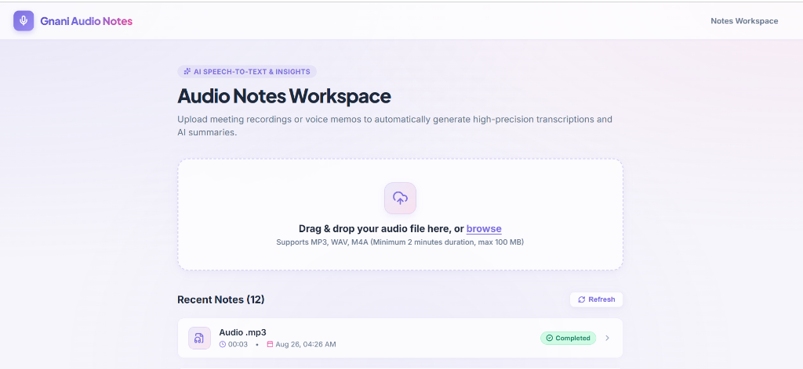
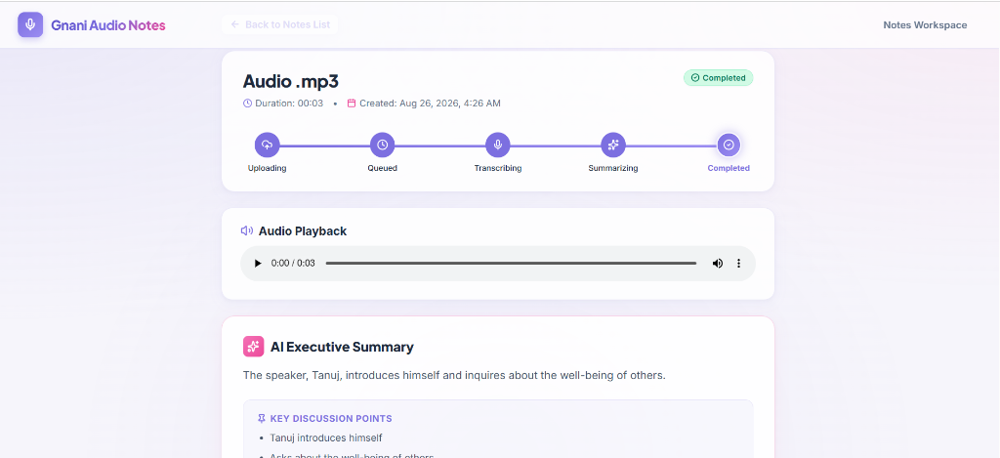
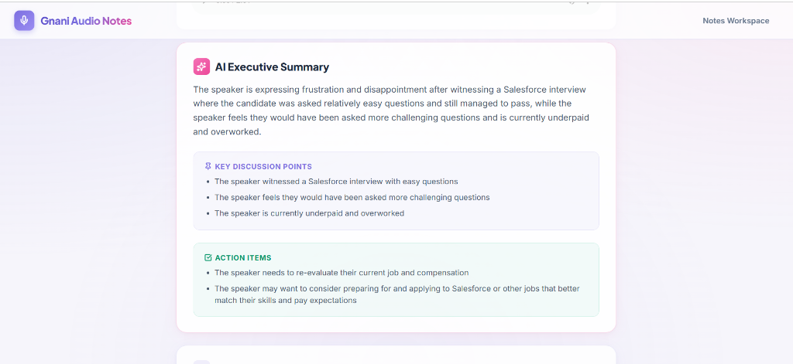
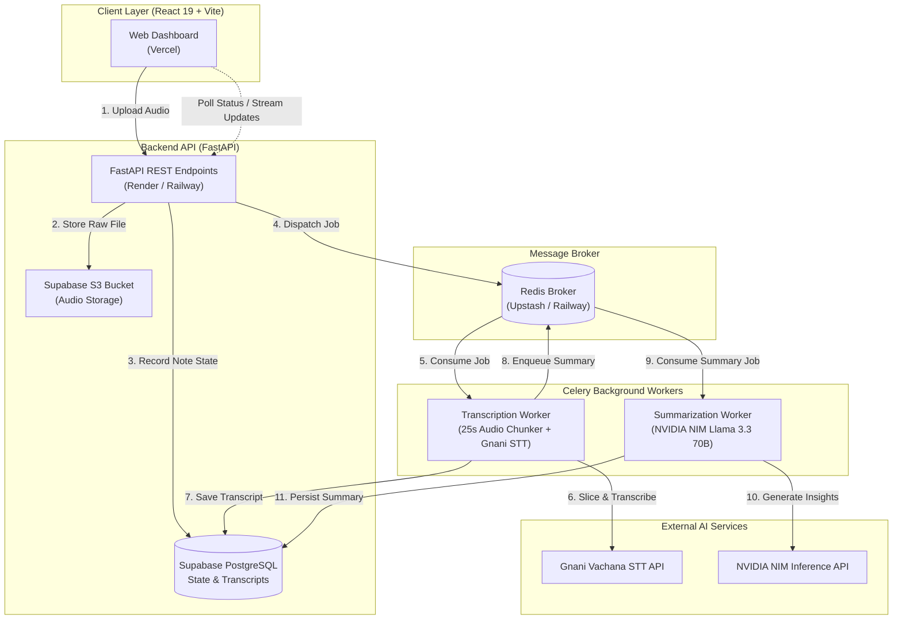

# 🎙️ Gnani Audio Notes Platform

<div align="center">

[](https://frontend-azure-beta-45.vercel.app/)
[](https://fastapi.tiangolo.com/)
[](https://react.dev/)
[](https://www.typescriptlang.org/)
[](https://docs.celeryq.dev/)
[](https://supabase.com/)
[](https://build.nvidia.com/)

**An asynchronous enterprise-grade audio intelligence platform for uploading, chunking, transcribing, and summarizing long-form audio files into structured executive notes and actionable insights.**

[🌐 Explore Live Application](https://frontend-azure-beta-45.vercel.app/) • [📖 Architecture](#-architecture-overview) • [⚡ Quickstart](#-quickstart-guide) • [🚀 Deployment](#-deployment-guide)

</div>

---

## 📸 Application Showcase

### 1. Workspace & Intelligent Upload Dropzone
Upload audio recordings (`.mp3`, `.wav`, `.m4a`) with live client-side validation, drag-and-drop glassmorphic dropzone, and responsive note history.

<div align="center">
  
</div>

<br/>

### 2. Live 5-Stage Processing Stepper & Audio Player
Track processing in real time across **Uploading $\rightarrow$ Queued $\rightarrow$ Transcribing $\rightarrow$ Summarizing $\rightarrow$ Completed** with in-browser audio playback.

<div align="center">
  
</div>

<br/>

### 3. AI Executive Summary, Key Discussion Points & Action Items
Extract concise executive summaries, structured bullet points, and prioritized action items powered by **NVIDIA NIM Llama 3.3 70B Instruct**.

<div align="center">
  
</div>

---

## ✨ Key Features

- **⚡ Asynchronous Queue Architecture**: Decoupled FastAPI backend and Celery task workers backed by Redis for reliable background job execution.
- **✂️ Dynamic 25s Audio Chunking Pipeline**: Seamlessly slices long audio files into 25-second segments with 2-second overlap, overcoming strict third-party STT duration limits (`MAX_AUDIO_DURATION_EXCEEDED`) and rebuilding unified transcripts.
- **🎙️ Gnani Vachana STT Integration**: High-accuracy speech-to-text API integration with automatic token refresh, error parsing, and rate limiting.
- **🧠 NVIDIA NIM AI Summarization**: State-of-the-art Llama 3.3 70B Instruct model prompts generate structured JSON output with executive summaries, key talking points, and actionable items.
- **🛡️ Resilient Retry & Failure Recovery**: Idempotent queue workers with exponential backoff and interactive UI retry controls for failed transcription or summarization steps.
- **🎨 Modern Glassmorphic Dashboard**: Light aesthetic designed with soft lavender, violet, and rose accents, Lucide icons, pulsing shimmer skeletons, and fluid micro-animations.
- **☁️ S3-Compatible Cloud Storage**: Direct audio ingestion and secure presigned URL generation for audio playback via Supabase Object Storage.

---

## 🏛️ Architecture Overview



---

## 🧩 Tech Stack

| Layer | Technology | Purpose |
|---|---|---|
| **Frontend** | React 19, TypeScript, Vite | Fast, type-safe, responsive glassmorphic web UI |
| **Icons & UI** | Lucide React, Vanilla CSS | Lightweight, consistent design system & animations |
| **Backend API** | FastAPI, Pydantic v2 | High-performance asynchronous REST API & validation |
| **Background Processing** | Celery, Redis | Distributed task queues with exponential backoff retries |
| **Database** | PostgreSQL (Supabase), SQLAlchemy, Alembic | Relational data persistence and schema migrations |
| **Object Storage** | Supabase Storage (S3-Compatible) | Secure audio file storage and presigned playback |
| **Audio Processing** | PyDub, FFmpeg | Audio duration detection, format normalization & chunking |
| **Speech-to-Text** | Gnani Vachana STT v3 | Neural speech transcription engine |
| **AI Summarization** | NVIDIA NIM (Meta Llama 3.3 70B Instruct) | High-accuracy structured insight extraction |

---

## ⚡ Quickstart Guide

### Prerequisites
- **Python**: 3.11+
- **Node.js**: 18+
- **FFmpeg**: Installed and available in your system `PATH`
- **Redis Server**: Local instance or remote URL (e.g. Upstash)

---

### 1. Clone the Repository
```bash
git clone https://github.com/Princ3mish/Gnani-audio.git
cd Gnani-audio
```

---

### 2. Backend Setup
```bash
cd backend

# Create virtual environment
python -m venv .venv
# Windows
.\.venv\Scripts\activate
# Linux/macOS
source .venv/bin/activate

# Install dependencies
pip install -r requirements.txt

# Configure environment variables
cp .env.example .env
```

#### Run Database Migrations
```bash
python -m alembic -c app/alembic.ini upgrade head
```

#### Start Backend Services
- **Option A (Development — In-Process Celery Worker)**:
  ```bash
  uvicorn app.main:app --reload --port 8000
  ```
- **Option B (Separate Celery Worker)**:
  ```bash
  # Terminal 1: API
  uvicorn app.main:app --reload --port 8000

  # Terminal 2: Celery Worker
  celery -A app.celery_app worker --loglevel=info
  ```

---

### 3. Frontend Setup
```bash
cd ../frontend

# Install dependencies
npm install

# Start Vite dev server
npm run dev
```
Open [http://localhost:5173](http://localhost:5173) in your browser.

---

## ⚙️ Environment Variables

Create a `.env` file in `backend/` with the following variables:

```env
# Database (Supabase PostgreSQL)
DATABASE_URL=postgresql://postgres:<password>@aws-0-ap-northeast-1.pooler.supabase.com:5432/postgres

# Redis Broker (Upstash / Railway)
REDIS_URL=rediss://default:<password>@<host>:6379/0

# Object Storage (Supabase S3)
STORAGE_ENDPOINT=https://<ref>.storage.supabase.co/storage/v1/s3
STORAGE_ACCESS_KEY=<supabase-storage-access-key>
STORAGE_SECRET_KEY=<supabase-storage-secret-key>
STORAGE_BUCKET=audio-notes

# Gnani STT API
GNANI_API_KEY=<your-gnani-api-key>
GNANI_BASE_URL=https://api.vachana.ai

# NVIDIA NIM LLM
LLM_API_KEY=<your-nvidia-nim-key>
LLM_MODEL=meta/llama-3.3-70b-instruct
LLM_BASE_URL=https://integrate.api.nvidia.com/v1

# Security & CORS
FRONTEND_URL=https://frontend-azure-beta-45.vercel.app,http://localhost:5173
```

---

## 🚀 Deployment Guide

### Frontend on Vercel
1. Import repository on [Vercel](https://vercel.com).
2. Set **Root Directory** to `frontend`.
3. Set **Framework Preset** to `Vite`.
4. Configure Environment Variable:
   - `VITE_API_BASE_URL`: `https://gnani-audio.onrender.com`

---

### Backend on Render (Single-Service Free Tier)
Render's free tier provides a single web service. The application uses an in-process daemon worker thread (`--pool=solo`) to execute Celery tasks directly inside the FastAPI lifespan without requiring a second paid instance:
1. Create a **Web Service** on [Render](https://render.com).
2. Set **Root Directory** to `backend`.
3. Set **Runtime** to `Python 3`.
4. **Build Command**: `pip install -r requirements.txt`
5. **Start Command**: `uvicorn app.main:app --host 0.0.0.0 --port $PORT`
6. Add the environment variables listed in the `.env` template above.

---

## 🛡️ Error Handling & Resilience

- **Audio Chunking Guarantee**: Files $\ge 25\text{s}$ are segmented dynamically using `AudioChunkingService` with a 2-second overlap, avoiding third-party STT 30-second duration hard ceilings.
- **Exponential Backoff**: Up to 3 automatic retries with exponential backoff on transient upstream LLM/STT connection dropouts.
- **Fail-Safe UI Retries**: In case of network errors or token exhaustion, users can trigger targeted retries (`Retry Transcription` or `Retry Summarization`) directly from the note detail view.

---

<div align="center">

Built with 💜 by [Princ3mish](https://github.com/Princ3mish)

</div>
